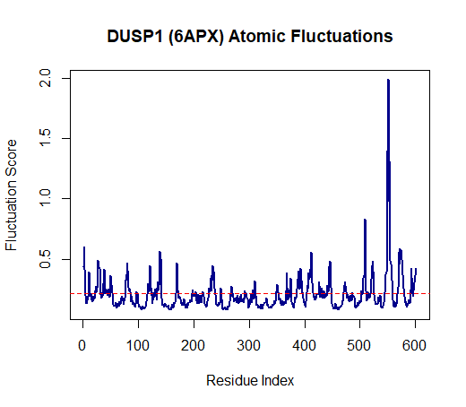

# Structural Analysis & Flexibility Mapping of Human DUSP1

This project focuses on the computational structural biology of the Dual Specificity Phosphatase 1 (**DUSP1**). Using Normal Mode Analysis (NMA), I mapped the intrinsic dynamics and atomic fluctuations of the DUSP1 catalytic domain.

## Scientific Context
DUSP1 is a critical regulator of MAPK signaling. Understanding the flexibility of its catalytic domain (PDB: **6APX**) provides insight into how the protein undergoes conformational changes during substrate binding and catalysis.

## Structural Dynamics Results

### Atomic Fluctuation Profile
The plot below illustrates the B-factor related fluctuations across the amino acid sequence. High peaks identify flexible loop regions, while troughs represent the stable alpha-helices and beta-sheets of the catalytic core.

